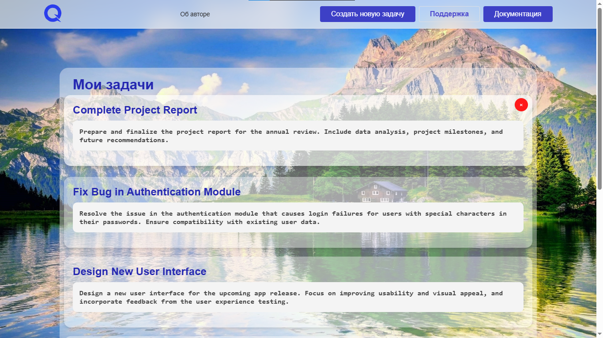
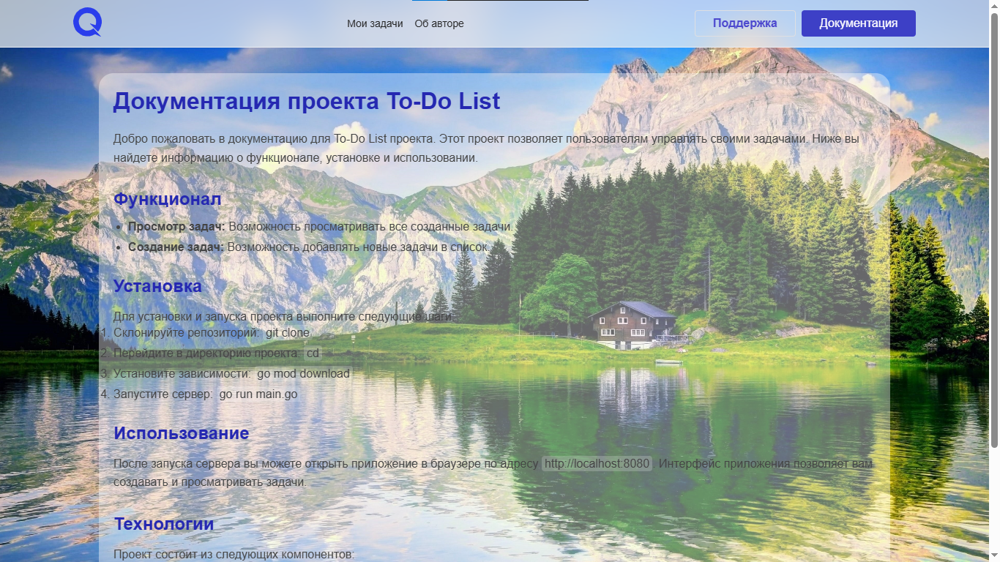

# To-Do List

## Описание проекта

To-Do List — это простой веб-приложение для управления задачами. Проект состоит из двух частей: бэкенда, написанного на Go, и фронтенда, использующего HTML, CSS и JavaScript. Пользователи могут просматривать и создавать задачи в удобном интерфейсе.

## Функциональные возможности

- Просмотр списка задач
- Создание новых задач
- Удобный и интуитивно понятный интерфейс

## Установка и запуск

### Бэкенд (Go)

1. Убедитесь, что у вас установлен Go. Вы можете скачать его с [официального сайта](https://golang.org/dl/).

2. Перейдите в каталог `backend`:

   ```bash
   cd backend
   ```

3. Установите необходимые зависимости (если есть):

   ```bash
   go mod tidy
   ```

4. Запустите сервер:

   ```bash
   go run main.go
   ```

   Сервер будет запущен на порту 8080.

### Фронтенд

1. Перейдите в каталог `frontend`.

2. Откройте файл `index.html` в браузере или настройте локальный сервер для его обслуживания.

## API

### Получение списка задач

- **URL:** `/tasks`
- **Метод:** `GET`
- **Описание:** Возвращает список всех задач.
- **Ответ:**

  ```json
  [
    {
      "title": "Задача 1",
      "description": "Описание задачи 1",
      "status": "новая"
    },
    {
      "title": "Задача 2",
      "description": "Описание задачи 2",
      "status": "новая"
    }
  ]
  ```

### Создание новой задачи

- **URL:** `/tasks`
- **Метод:** `POST`
- **Описание:** Создает новую задачу.
- **Тело запроса:**

  ```json
  {
    "title": "Название задачи",
    "description": "Описание задачи",
    "status": "новая"
  }
  ```

- **Ответ:**

  ```json
  {
    "title": "Название задачи",
    "description": "Описание задачи",
    "status": "новая"
  }
  ```

## Использование фронтенда

1. Откройте файл `template/index.html` в браузере.

2. Используйте интерфейс для просмотра и создания задач.




### Основные файлы

- `template/index.html` — основной HTML-файл, содержащий разметку страницы.
- `template/css/main.css` — стили для оформления страницы.
- `template/js/main.js` — JavaScript-файл, обеспечивающий взаимодействие с бэкендом и динамическое обновление интерфейса.

## Пример использования

1. Откройте приложение в браузере.

2. Введите заголовок и описание задачи в форме создания задачи.

3. Нажмите кнопку "Создать задачу", чтобы добавить задачу в список.

4. Список задач обновится автоматически.

## Лицензия

Этот проект лицензируется под [MIT License](LICENSE).

## Контрибьюции

Если вы хотите внести изменения в проект, пожалуйста, создайте Pull Request или обратитесь к автору для обсуждения предложений.

## Контакт

Если у вас есть вопросы или предложения, вы можете связаться с автором по электронной почте: [karimovbezan0@gmail.com](mailto:karimovbezan0@gmail.com).
